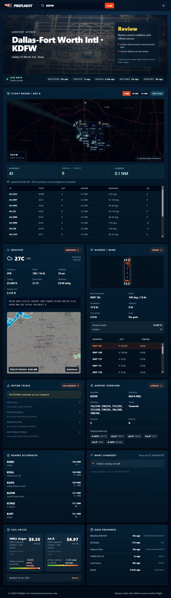

# Preflight

<p align="center">
  
</p>

**An at-a-glance situational-awareness dashboard for the student- and private-pilot (PPL) community.**

Preflight pulls the critical pre-flight information a pilot needs about any U.S. airport — live weather, winds and runway selection, precipitation radar, nearby traffic, NOTAMs, TFRs, fuel prices, frequencies, and nearby alternates — and presents it on a single, fast-loading "SITREP" screen.

🔗 **Live site:** https://preflightapp.netlify.app/

This repository is the source for that one live app. Contributions made here ship to the live site, so improvements reach every pilot who uses it — the goal is to make **Preflight** better together, not to spin up separate copies. See [Contributing](#contributing) to get involved.

> ⚠️ **For situational awareness only.** Preflight is a convenience dashboard, **not** an official briefing source. Always verify with official FAA / NWS sources (1800wxbrief.com, aviationweather.gov, official NOTAM/TFR feeds) before every flight.

---

## Screenshot

The dashboard is a long, single-page layout. A full-page capture is included in the repo:

<details>
<summary>📸 <strong>Click to view the full-page screenshot</strong></summary>

<br>

[](screenshot.png)

</details>

> The image is large — [open `screenshot.png` directly](screenshot.png) for full resolution.

---

## Features

Enter any U.S. airport identifier (ICAO or 3-letter FAA code) and Preflight assembles a live operations picture:

| Panel | What it shows |
| --- | --- |
| **Airport SITREP** | A single favorable / review / not-recommended call synthesized from weather, winds, NOTAMs, and nearby TFRs — with the reasoning bullets behind it. |
| **Live Data strip** | Per-feed freshness (live / stale / unavailable) so you always know how current the picture is. |
| **Weather** | Current METAR, flight category, wind, visibility, ceiling, temp/dew point, altimeter, and a rule-of-thumb **density altitude**, plus the raw METAR string. |
| **Precipitation radar** | RainViewer radar tiles composited over an OpenStreetMap base, centered on the airport — no map library required. |
| **Runway / Wind** | Ranks every runway end by headwind component, with head/tail/crosswind and gust breakdowns for the best option. |
| **Fuel Prices** | 100LL / Jet-A prices from AirNav with a comparison against the market/national average. |
| **Traffic Scope** | Nearby ADS-B traffic (callsign, type, altitude, speed, track) within a configurable radius. |
| **NOTAM Triage** | NOTAMs auto-bucketed into Critical / Operational / Navigation / Informational, with the raw text one click away. |
| **Airport Overview** | Elevation, runways, tower status, services, beacon, and CTAF/approach/clearance frequencies. |
| **Nearby Alternates** | Closest reporting airports with distance, bearing, and current flight category — click to jump to that airport. |
| **What Changed?** | Diffs the current snapshot against your last visit (wind shift, ceiling, traffic count, NOTAM count, altimeter). |
| **Data Freshness** | Age and source of every feed in one place. |

Quick links throughout the UI deep-link to SkyVector charts, LiveATC, the AviationWeather briefing, and the FAA NOTAM search for the selected airport.

---

## Data Sources

All core feeds are **free and require no API key**. Requests are proxied through Netlify Functions (never called directly from the browser), which keeps third-party hosts happy and centralizes auth.

| Feed | Source |
| --- | --- |
| METAR / TAF / winds / G-AIRMET | [AviationWeather.gov](https://aviationweather.gov/) (NOAA) |
| Airport data & nearby stations | AviationWeather.gov + FAA |
| Precipitation radar | [RainViewer](https://www.rainviewer.com/) |
| Base map tiles | [OpenStreetMap](https://www.openstreetmap.org/) |
| ADS-B traffic | [adsb.fi](https://adsb.fi/) open data |
| Fuel prices | [AirNav](https://www.airnav.com/) |
| TFRs | FAA TFR API + AviationWeather |
| Airport imagery | Wikipedia API |
| NOTAMs | [FAA NOTAM API](https://api.faa.gov/) *(requires free credentials — see below)* |

---

## Tech Stack

- **Frontend:** React 18, Vite 5, Tailwind CSS 3, [TanStack React Query](https://tanstack.com/query) for fetching/caching, `lucide-react` icons, `date-fns` / `date-fns-tz`, Recharts.
- **Backend:** [Netlify Functions](https://docs.netlify.com/functions/overview/) (serverless), bundled with esbuild. A shared bearer-token guard gates every function.
- **Persistence:** [Netlify Blobs](https://docs.netlify.com/blobs/overview/) (used for personal config such as saved minimums).
- **Hosting:** Netlify (static `dist` + functions), continuous deploy from `main`.

---

## Project Structure

```
preflight/
├── src/
│   ├── App.jsx              # Dashboard composition + aviation helpers
│   ├── components/          # UI: panels, layout, forms, primitives
│   ├── hooks/               # React Query hooks (one per data feed)
│   └── lib/                 # api client, constants, density alt, crosswind, go/no-go, time
├── netlify/
│   └── functions/          # Serverless proxies: weather, traffic, fuel, airport,
│                           #   radar, tfr, notams, airport-image, blobs, export
├── public/                  # Static assets
├── netlify.toml             # Build / dev / security-header config
├── .env.example             # Environment variable template
└── vite.config.js
```

---

## Local Development

Want to contribute? Here's how to get Preflight running on your machine to develop and test changes before opening a pull request.

**Prerequisites:** Node.js 18+ and npm.

```bash
# 1. Install dependencies
npm install

# 2. Create your local env file
cp .env.example .env.local

# 3. Generate a shared auth token (any 32+ char random string works)
openssl rand -hex 32
```

Set **both** of these to that same value in `.env.local`:

- `VITE_API_AUTH_TOKEN` — sent by the browser
- `API_AUTH_TOKEN` — validated by the functions

Then start the dev server (Netlify Dev runs Vite + the functions together):

```bash
npm run dev
# open http://localhost:8888
```

> NOTAMs are the only feed that needs credentials. Without them, every other panel works and the NOTAM card simply shows a "not configured" notice.

### Environment Variables

| Variable | Required | Purpose |
| --- | --- | --- |
| `API_AUTH_TOKEN` | ✅ | Server-side token used by Netlify Functions to authorize requests. |
| `VITE_API_AUTH_TOKEN` | ✅ | Browser-side token sent to the functions. **Must exactly match** `API_AUTH_TOKEN` and be present *before* the Vite build runs. |
| `VITE_AIRPORT_ICAO` | optional | Default airport on first load (defaults to `KVBT`). |
| `FAA_NOTAM_CLIENT_ID` | optional | FAA NOTAM API client ID — register free at [api.faa.gov](https://api.faa.gov/). |
| `FAA_NOTAM_CLIENT_SECRET` | optional | FAA NOTAM API client secret. |

> ℹ️ **Security note:** `VITE_*` variables are compiled into the browser bundle and are therefore readable by anyone who loads the page. The shared token only deters random scanners from hitting the function URLs directly — it is **not** a secret and is not meant to protect against a determined visitor. Keep your *local* token different from production, and never reuse a real secret in a `VITE_` variable.

---

## Contributing

Preflight is **one live application**, and this repository is its source of truth. The goal isn't for everyone to run their own copy — it's to improve the single app that pilots actually use. When a change lands on `main`, it deploys automatically to [preflightapp.netlify.app](https://preflightapp.netlify.app/).

Contributions of all sizes are welcome — bug fixes, new data sources, UI polish, or just blunt "this is bad practice, here's why" feedback.

**Workflow:**

1. **Fork** this repo and create a branch for your change.
2. Get it running locally (see [Local Development](#local-development)) and test against a few real airports.
3. Run `npm run lint` and make sure it passes.
4. Open a **pull request** against `main` describing what you changed and why.
5. Once reviewed and merged, your change ships to the live site automatically.

Not sure where to start? Open an [issue](../../issues) — bug reports, feature ideas, and questions are all fair game.

---

## Known Limitations

- **Density altitude** uses a rule-of-thumb formula, not a full performance calculation.
- The **go/no-go SITREP** is a heuristic aid for review — it is not a substitute for a full weather briefing or pilot judgment.
- **Fuel and NOTAM** data is normalized from third-party sources whose formats change over time; always confirm against the official source links provided in-app.
- Coverage and accuracy of ADS-B traffic depend on the adsb.fi community network.

---

## Scripts

| Command | Description |
| --- | --- |
| `npm run dev` | Netlify Dev (Vite + functions) on `http://localhost:8888`. |
| `npm run vite-only` | Vite dev server only (no functions). |
| `npm run build` | Production build to `dist/`. |
| `npm run preview` | Preview the production build. |
| `npm run lint` | ESLint over `src`. |

---

## Disclaimer

Preflight is a personal project provided for educational and situational-awareness purposes only. It is **not** an approved source for flight planning, weather briefing, or operational decisions. The author assumes no responsibility for decisions made using this tool. **The pilot in command is always responsible for verifying all information against official sources.**

---

## A Note on How This Was Built

This project was built with significant help from AI (Claude). I worked as a web developer early in my career, but that was a long time ago, and I'll happily admit those skills have gotten rusty in the years since. Preflight is a domain project built by someone scratching their own itch — a tool to solve a real problem I had as a student pilot — not a polished commercial product.

What I've checked so far has mostly been hands-on:

- Manual testing in the browser against a range of real U.S. airports (towered and non-towered, single- and multi-runway, with and without live fuel/NOTAM data)
- That each panel degrades gracefully when its data source is unavailable or returns nothing
- ESLint passes cleanly

That leaves plenty I'd genuinely welcome a second set of eyes on:

- **Security & input validation** — especially the Netlify Functions and how external API data is handled
- **Edge cases** I haven't thought to test
- **Code quality & idiomatic patterns** — places where this isn't the modern, idiomatic way to do things

Issues and PRs are genuinely welcome — including blunt "this is bad practice, here's why" feedback. I'm here to learn.

---

## License

Released under the [MIT License](LICENSE).
